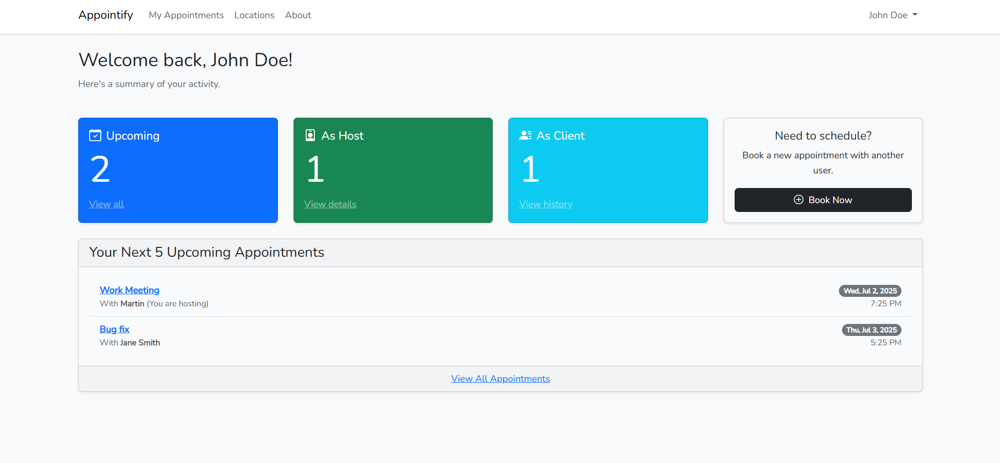
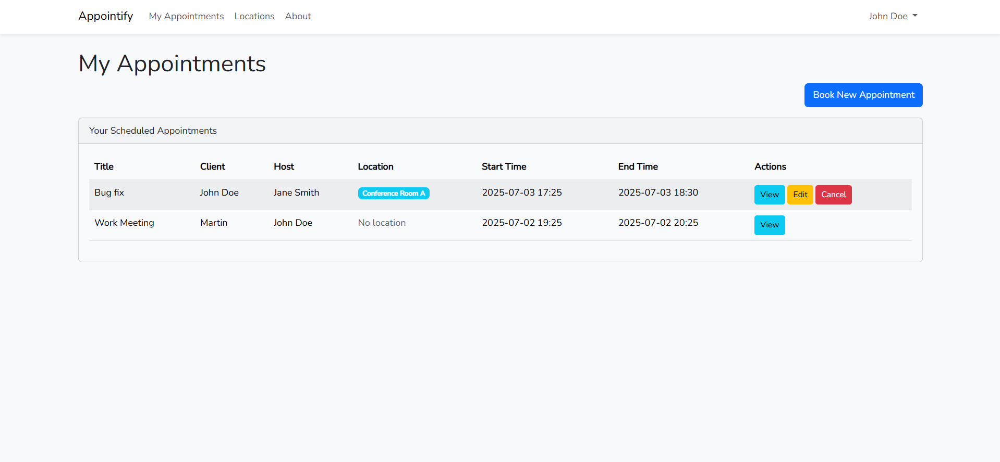
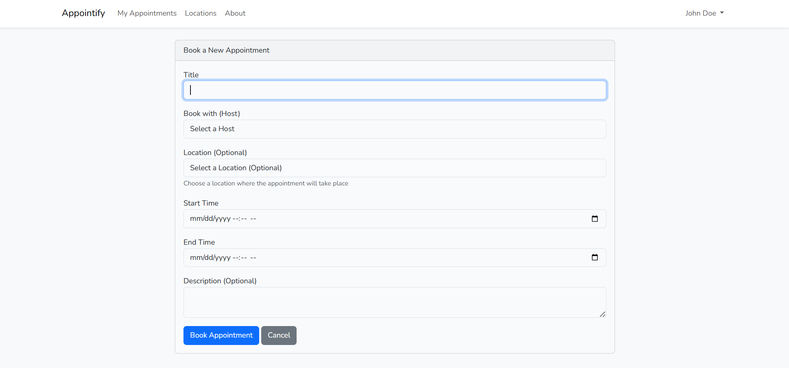
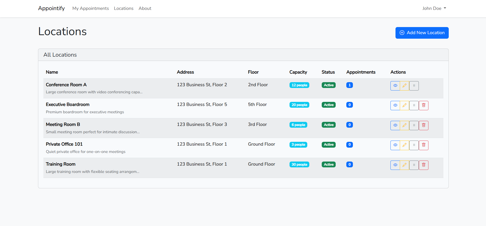
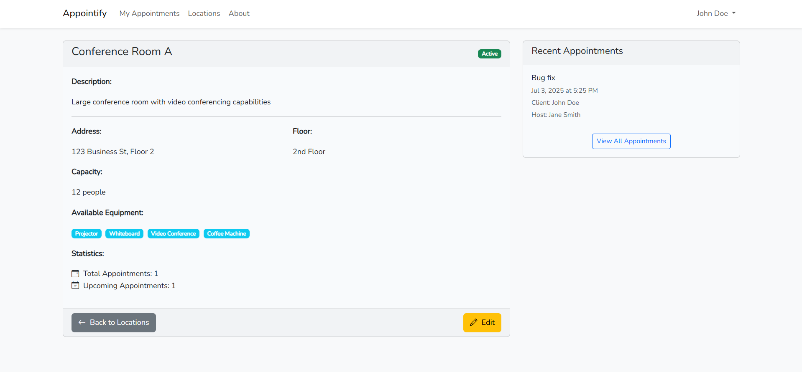

# Appointify - Laravel Appointment Management System

A comprehensive appointment scheduling application built with Laravel 10, featuring user authentication, appointment management, location management, and a clean Bootstrap interface.

## Features

- 🔐 **User Authentication** - Login, registration, and logout functionality
- 📅 **Appointment Management** - Create, view, edit, and cancel appointments
- 🏢 **Location Management** - Manage meeting rooms, offices, and venues
- 👥 **Multi-user Support** - Users can schedule appointments with other users
- 🎨 **Responsive Design** - Clean Bootstrap interface that works on all devices
- 🔒 **Authorization** - Users can only manage their own appointments
- 📊 **Dashboard** - Overview of appointments and statistics
- 📍 **Venue Tracking** - Assign specific locations to appointments
- ⚙️ **Equipment Management** - Track available equipment per location

## Screenshots

### Dashboard


### Appointments Management
<div align="center">
  
  
</div>

### Location Management
<div align="center">
  
  
</div>

## Requirements

- PHP >= 8.1
- Composer
- Node.js & NPM
- MySQL or another supported database
- Git

## Installation

### 1. Clone the Repository

```bash
git clone https://github.com/Kafkanikov/appointmentlrv.git
cd appointmentlrv
```

### 2. Install Dependencies

```bash
# Install PHP dependencies
composer install

# Install JavaScript dependencies
npm install
```

### 3. Environment Setup

```bash
# Copy environment file
cp .env.example .env

# Generate application key
php artisan key:generate
```

### 4. Database Configuration

Edit your `.env` file with your database credentials:

```env
DB_CONNECTION=mysql
DB_HOST=127.0.0.1
DB_PORT=3306
DB_DATABASE=appointment_app
DB_USERNAME=your_username
DB_PASSWORD=your_password
```

### 5. Database Setup

```bash
# Run migrations to create tables
php artisan migrate

# Seed the database with sample data (optional)
php artisan db:seed
```

This will create:
- Sample users (UserSeeder)
- Sample locations (LocationSeeder)

### 6. Compile Assets

```bash
# Compile assets for development
npm run dev

# OR compile for production
npm run build
```

### 7. Start the Development Server

```bash
php artisan serve
```

Visit `http://localhost:8000` in your browser.

## Default Sample Data

### Users (if seeded)
| Email | Password | Name |
|-------|----------|------|
| john@example.com | password123 | John Doe |
| jane@example.com | password123 | Jane Smith |
| admin@example.com | password123 | Admin User |

### Locations (if seeded)
- Conference Room A (10 people capacity)
- Meeting Room B (6 people capacity)  
- Executive Office (4 people capacity)
- Training Room (20 people capacity)
- Reception Area (50 people capacity)

## Project Structure

```
appointment-app/
├── app/
│   ├── Http/Controllers/
│   │   ├── AppointmentController.php    # Appointment CRUD operations
│   │   ├── LocationController.php       # Location management
│   │   ├── HomeController.php           # Dashboard logic
│   │   └── PageController.php           # Static pages
│   └── Models/
│       ├── User.php                     # User model (custom tb_users table)
│       ├── Appointment.php              # Appointment model
│       └── Location.php                 # Location model
├── database/
│   ├── migrations/
│   │   ├── create_tb_users_table.php    # Custom users table
│   │   ├── create_appointments_table.php
│   │   ├── create_tb_locations_table.php
│   │   └── add_location_id_to_appointments_table.php
│   └── seeders/
│       ├── UserSeeder.php               # Sample user data
│       ├── LocationSeeder.php           # Sample location data
│       └── DatabaseSeeder.php           # Main seeder orchestrator
├── resources/
│   └── views/
│       ├── appointments/                # Appointment views
│       │   ├── index.blade.php         # List appointments
│       │   ├── create.blade.php        # Create appointment
│       │   ├── edit.blade.php          # Edit appointment
│       │   └── show.blade.php          # View appointment
│       ├── locations/                   # Location management views
│       │   ├── index.blade.php         # List locations
│       │   ├── create.blade.php        # Create location
│       │   ├── edit.blade.php          # Edit location
│       │   └── show.blade.php          # View location
│       ├── layouts/
│       │   └── app.blade.php           # Main layout with navigation
│       └── home.blade.php              # Dashboard
└── routes/
    └── web.php                         # Application routes
```

## Database Schema

### tb_users Table
- `user_id` (Primary Key)
- `name`
- `email`
- `password`
- `email_verified_at`
- `remember_token`
- `created_at`
- `updated_at`

### appointments Table
- `appointment_id` (Primary Key)
- `title`
- `description`
- `client_id` (Foreign Key to tb_users)
- `host_id` (Foreign Key to tb_users)
- `location_id` (Foreign Key to tb_locations, nullable)
- `start_time`
- `end_time`
- `created_at`
- `updated_at`

### tb_locations Table
- `location_id` (Primary Key)
- `name`
- `description`
- `address`
- `floor`
- `capacity`
- `equipment` (JSON field)
- `is_active`
- `created_at`
- `updated_at`

## Usage Guide

### 🏢 Managing Locations

#### Creating a Location
1. Navigate to "Locations" in the menu
2. Click "Add New Location"
3. Fill in location details:
   - **Name**: Room or venue name
   - **Description**: Purpose or additional info
   - **Address**: Full address (optional)
   - **Floor**: Building floor (optional)
   - **Capacity**: Maximum people
   - **Equipment**: Available equipment (e.g., "Projector, Whiteboard")
4. Click "Create Location"

#### Managing Existing Locations
- **View Details**: Click location name to see full details and recent appointments
- **Edit**: Click "Edit" to modify location information
- **Toggle Status**: Use the status toggle to activate/deactivate locations
- **Delete**: Remove locations (only if no appointments are assigned)

### 📅 Managing Appointments

#### Creating an Appointment
1. Log in to your account
2. Navigate to "My Appointments"
3. Click "Create New Appointment"
4. Fill in appointment details:
   - **Title**: Meeting or appointment name
   - **Host**: Select from available users
   - **Location**: Choose from active locations (optional)
   - **Start Time**: When the appointment begins
   - **End Time**: When the appointment ends
   - **Description**: Additional details (optional)
5. Click "Create Appointment"

#### Managing Appointments
- **View**: Click appointment title to see full details including location info
- **Edit**: Click "Edit" button (only for appointments you created)
- **Cancel**: Click "Cancel Appointment" and confirm (only for your appointments)
- **Location Info**: View location details, capacity, and equipment in appointment details

### 📊 Dashboard Features
- View upcoming appointments with location information
- Quick statistics on total appointments
- Recent activity overview
- Navigation to appointments and locations

## API Routes

### Appointment Routes
```php
GET    /appointments          # List all user's appointments
GET    /appointments/create   # Show create form
POST   /appointments          # Store new appointment
GET    /appointments/{id}     # Show specific appointment
GET    /appointments/{id}/edit # Show edit form
PUT    /appointments/{id}     # Update appointment
DELETE /appointments/{id}     # Delete appointment
```

### Location Routes
```php
GET    /locations             # List all locations
GET    /locations/create      # Show create form
POST   /locations             # Store new location
GET    /locations/{id}        # Show specific location
GET    /locations/{id}/edit   # Show edit form
PUT    /locations/{id}        # Update location
DELETE /locations/{id}        # Delete location
PATCH  /locations/{id}/toggle-status # Toggle active status
```

## Key Features Explained

### 🏢 Location Management System
- **CRUD Operations**: Full create, read, update, delete functionality
- **Status Management**: Activate/deactivate locations without deleting
- **Equipment Tracking**: Store available equipment as flexible JSON data
- **Capacity Management**: Track maximum occupancy for each location
- **Address & Floor Info**: Complete location details for easy navigation
- **Appointment Integration**: Seamlessly link locations to appointments
- **Usage Analytics**: View recent appointments for each location

### 📅 Enhanced Appointment System
- **Location Assignment**: Optional location selection for appointments
- **Visual Integration**: Location details displayed in appointment views
- **Validation**: Ensures selected locations exist and are active
- **Flexible Design**: Appointments can exist with or without locations
- **Smart Filtering**: Only active locations appear in selection dropdowns

### 🔐 Security & Authorization
- **Authentication Required**: All appointment and location operations require login
- **User Ownership**: Users can only edit/delete their own appointments
- **Data Protection**: CSRF tokens on all forms
- **Input Validation**: Comprehensive validation on all inputs
- **Safe Deletion**: Prevents deletion of locations with existing appointments

## Development

### Running Tests
```bash
php artisan test
```

### Code Style
```bash
# Run PHP CS Fixer
vendor/bin/php-cs-fixer fix
```

### Watch Assets During Development
```bash
npm run dev
# or for auto-recompiling
npm run watch
```

### Database Operations
```bash
# Fresh migration with seeders
php artisan migrate:fresh --seed

# Just run seeders
php artisan db:seed

# Run specific seeder
php artisan db:seed --class=LocationSeeder
```

## Troubleshooting

### Common Issues

1. **Database Connection Error**
   - Check your `.env` database credentials
   - Ensure your database server is running
   - Verify the database exists

2. **Migration Errors**
   ```bash
   php artisan migrate:fresh --seed
   ```

3. **Permission Errors**
   ```bash
   chmod -R 775 storage bootstrap/cache
   ```

4. **Assets Not Loading**
   ```bash
   npm run dev
   php artisan storage:link
   ```

5. **Location Not Showing in Appointments**
   - Ensure locations are marked as active
   - Check that location exists in database
   - Verify foreign key relationships

## Future Enhancements

### Planned Features
- 📊 **Analytics Dashboard** - Usage statistics for locations and appointments
- 🔄 **Recurring Appointments** - Weekly, monthly appointment patterns
- 📧 **Email Notifications** - Automatic reminders and confirmations
- 📱 **Mobile API** - REST API for mobile app integration
- 🎨 **Calendar View** - Visual calendar interface for appointments
- 👥 **Team Management** - Department and organization support
- 💰 **Billing Integration** - Invoice generation for appointments
- ⭐ **Rating System** - Review locations and service providers

## Contributing

1. Fork the repository
2. Create a feature branch (`git checkout -b feature/amazing-feature`)
3. Commit your changes (`git commit -m 'Add some amazing feature'`)
4. Push to the branch (`git push origin feature/amazing-feature`)
5. Open a Pull Request

### Development Guidelines
- Follow PSR-12 coding standards
- Write comprehensive tests for new features
- Update documentation for any new functionality
- Use semantic commit messages

## License

This project is open-sourced software licensed under the [MIT license](https://opensource.org/licenses/MIT).

## Contact

- **GitHub**: [Kafkanikov](https://github.com/Kafkanikov)
- **Project Repository**: [appointmentlrv](https://github.com/Kafkanikov/appointmentlrv)

## Changelog

### v1.1.0 (2025-07-02)
- ✨ Added complete Location Management system
- 🏢 Location CRUD operations with equipment tracking
- 📍 Integrated locations with appointment system
- ⚙️ Location status management (active/inactive)
- 🔗 Enhanced appointment views with location details
- 📊 Location usage analytics
- 🌱 Added LocationSeeder for sample data

### v1.0.0 (2025-07-02)
- 🎉 Initial release
- 🔐 User authentication system
- 📅 Appointment CRUD operations
- 📱 Responsive dashboard
- 🗃️ Custom database schema with tb_users table

---

**Built with ❤️ using Laravel Framework**

*Appointify - Making appointment scheduling simple and efficient* 📅✨
