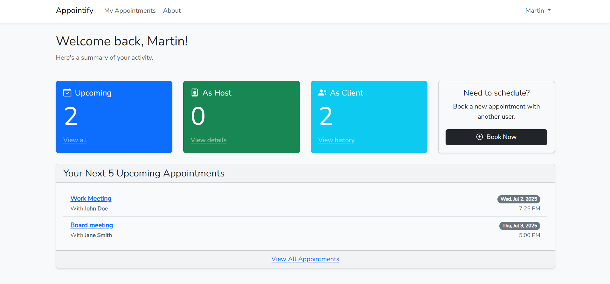
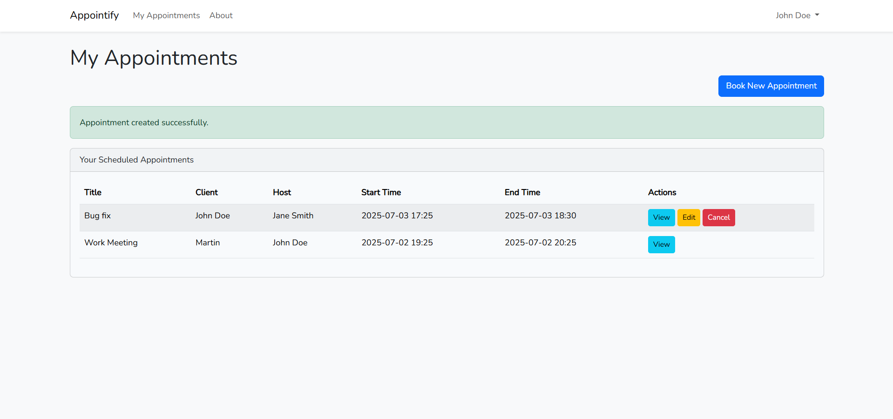

# Appointify - Laravel Appointment Management System

A simple and elegant appointment scheduling application built with Laravel 10, featuring user authentication, appointment management, and a clean Bootstrap interface.

## Features

- 🔐 **User Authentication** - Login, registration, and logout functionality
- 📅 **Appointment Management** - Create, view, edit, and cancel appointments
- 👥 **Multi-user Support** - Users can schedule appointments with other users
- 🎨 **Responsive Design** - Clean Bootstrap interface that works on all devices
- 🔒 **Authorization** - Users can only manage their own appointments
- 📊 **Dashboard** - Overview of appointments and statistics

## Screenshots




## Requirements

- PHP >= 8.1
- Composer
- Node.js & NPM
- MySQL or another supported database
- Git

## Installation

### 1. Clone the Repository

```bash
git clone https://github.com/Kafkanikov/appointmentlrv.git
cd appointmentlrv
```

### 2. Install Dependencies

```bash
# Install PHP dependencies
composer install

# Install JavaScript dependencies
npm install
```

### 3. Environment Setup

```bash
# Copy environment file
cp .env.example .env

# Generate application key
php artisan key:generate
```

### 4. Database Configuration

Edit your `.env` file with your database credentials:

```env
DB_CONNECTION=mysql
DB_HOST=127.0.0.1
DB_PORT=3306
DB_DATABASE=appointment_app
DB_USERNAME=your_username
DB_PASSWORD=your_password
```

### 5. Database Setup

```bash
# Run migrations to create tables
php artisan migrate

# Seed the database with sample users (optional)
php artisan db:seed --class=UserSeeder
```

### 6. Compile Assets

```bash
# Compile assets for development
npm run dev

# OR compile for production
npm run build
```

### 7. Start the Development Server

```bash
php artisan serve
```

Visit `http://localhost:8000` in your browser.

## Default Users (if seeded)

| Email | Password | Name |
|-------|----------|------|
| john@example.com | password123 | John Doe |
| jane@example.com | password123 | Jane Smith |
| admin@example.com | password123 | Admin User |

## Project Structure

```
appointment-app/
├── app/
│   ├── Http/Controllers/
│   │   ├── AppointmentController.php    # Appointment CRUD operations
│   │   ├── HomeController.php           # Dashboard logic
│   │   └── PageController.php           # Static pages
│   └── Models/
│       ├── User.php                     # User model (custom tb_users table)
│       └── Appointment.php              # Appointment model
├── database/
│   ├── migrations/
│   │   ├── create_tb_users_table.php    # Custom users table
│   │   └── create_appointments_table.php
│   └── seeders/
│       └── UserSeeder.php               # Sample user data
├── resources/
│   └── views/
│       ├── appointments/                # Appointment views
│       │   ├── index.blade.php         # List appointments
│       │   ├── create.blade.php        # Create appointment
│       │   ├── edit.blade.php          # Edit appointment
│       │   └── show.blade.php          # View appointment
│       ├── layouts/
│       │   └── app.blade.php           # Main layout
│       └── home.blade.php              # Dashboard
└── routes/
    └── web.php                         # Application routes
```

## Database Schema

### tb_users Table
- `user_id` (Primary Key)
- `name`
- `email`
- `password`
- `email_verified_at`
- `remember_token`
- `created_at`
- `updated_at`

### appointments Table
- `appointment_id` (Primary Key)
- `title`
- `description`
- `client_id` (Foreign Key to tb_users)
- `host_id` (Foreign Key to tb_users)
- `start_time`
- `end_time`
- `created_at`
- `updated_at`

## Usage

### Creating an Appointment

1. Log in to your account
2. Navigate to "My Appointments"
3. Click "Create New Appointment"
4. Fill in the appointment details:
   - Title
   - Host (select from available users)
   - Start and end times
   - Description (optional)
5. Click "Create Appointment"

### Managing Appointments

- **View**: Click on any appointment title to see full details
- **Edit**: Click "Edit" button (only available for appointments you created)
- **Cancel**: Click "Cancel Appointment" and confirm (only for your appointments)

### Dashboard Features

- View upcoming appointments
- Quick statistics
- Recent activity overview

## API Routes

The application uses standard Laravel resource routes:

```php
GET    /appointments          # List all user's appointments
GET    /appointments/create   # Show create form
POST   /appointments          # Store new appointment
GET    /appointments/{id}     # Show specific appointment
GET    /appointments/{id}/edit # Show edit form
PUT    /appointments/{id}     # Update appointment
DELETE /appointments/{id}     # Delete appointment
```

## Contributing

1. Fork the repository
2. Create a feature branch (`git checkout -b feature/amazing-feature`)
3. Commit your changes (`git commit -m 'Add some amazing feature'`)
4. Push to the branch (`git push origin feature/amazing-feature`)
5. Open a Pull Request

## Development

### Running Tests

```bash
php artisan test
```

### Code Style

```bash
# Run PHP CS Fixer
vendor/bin/php-cs-fixer fix
```

### Watch Assets During Development

```bash
npm run dev
# or for auto-recompiling
npm run watch
```

## Troubleshooting

### Common Issues

1. **Database Connection Error**
   - Check your `.env` database credentials
   - Ensure your database server is running
   - Verify the database exists

2. **Permission Errors**
   ```bash
   chmod -R 775 storage bootstrap/cache
   ```

3. **Assets Not Loading**
   ```bash
   npm run dev
   php artisan storage:link
   ```

4. **Migration Errors**
   ```bash
   php artisan migrate:fresh --seed
   ```

## Security

- All routes are protected with authentication middleware
- CSRF protection enabled on all forms
- SQL injection protection through Eloquent ORM
- Password hashing using Laravel's built-in Hash facade

## License

This project is open-sourced software licensed under the [MIT license](https://opensource.org/licenses/MIT).

## Contact

- **GitHub**: [Kafkanikov](https://github.com/Kafkanikov)
- **Project Repository**: [appointmentlrv](https://github.com/Kafkanikov/appointmentlrv)

## Changelog

### v1.0.0 (2025-07-02)
- Initial release
- User authentication system
- Appointment CRUD operations
- Responsive dashboard
- Custom database schema with tb_users table

---

**Built with ❤️ using Laravel Framework**
